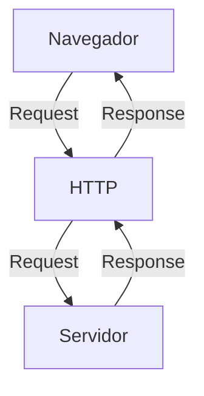

# Curso BackEnd -  1º Semestre - 105h

Prof. Diogo Barbosa

Escola SENAI Americana 

2º Semestre 2026

## Objetivos do Curso

- Desenvolver Aplicações web Server Side, utilizando a linguagem PHP;
- Aplicar Sintaxe nativa Php Vanilla;
- Manipulação HTTP;
- Persistência de Dados(Armazenamento em BD);
- Segurança contra SQL Injection/CSRF;
- Refatoração em POO (Programação Orientada Objeto);
- Arquitetura MVC;
- Utilização do FrameWork Laravel;

## Cronograma do Semestre

Carga Horária: 105h

Duração: 20 Semanas

### Semana 1: Introdução ao BackEnd e Configuração do Ambiente PHP

#### O que é BackEnd

O back-end é a parte de um site ou aplicativo que o usuário não vê, mas que faz tudo funcionar por trás das telas.

- Guarda e organiza informações em um banco de dados;
- Confere se o login e a senha estão corretos;
- Calcula valores, como o frete ou o total de uma compra;
- Garante que os dados de um usuário não apareçam para outro;
- Faz o sistema suportar muitas pessoas usando ao mesmo tempo, sem travar.

As principais linguagens utilizadas no desenvolvimento back-end são PHP, JavaScript/TypeScript, Python, Java, Kotlin, Go (Golang), C# e Rust. 

O backend é o "cérebro" oculto de um site ou aplicativo. Ele roda em um servidor e cuida de tudo o que o usuário não vê na tela.

**As 3 partes básicas de todo backend:**

1. **Servidor:** o "computador" que fica ligado esperando pedidos (requisições);
2. **Banco de dados:**  onde as informações ficam guardadas (usuários, produtos, mensagens, etc.);
3. **Lógica de negócio:**  as regras do sistema (ex: "não deixa comprar se não tiver estoque").

**O Mercado de Trabalho em Back-end**

O desenvolvimento Back-end é uma das áreas mais cruciais da Tecnologia da Informação. 

- Com a transformação digital acelerada, empresas de todos os portes e setores dependem de infraestruturas sólidas e seguras. 

- Setores de Atuação: Bancos, hospitais, e-commerces, logística, indústrias, startups e órgãos públicos utilizam Back-end para suportar suas operações críticas.

- Fatores de Crescimento: O avanço da computação em nuvem, aplicativos móveis, Big Data e IA impulsiona continuamente a busca por profissionais da área.

- Modelos de Trabalho: Alta flexibilidade com vagas presenciais, híbridas e remotas (inclusive com oportunidades internacionais).

#### Ciclo de Vida da Requsição HTTP

##### O que é HTTP

**HTTP**, Hypertext Transfer Protocol, é um protocolo de comunicação utilizado para transferência de informações na WWW(World Wide Web) e em outros sistemas de Redes.

O HTTP é a base para que o cliente e um servidor web troquem informações. Ele permite a requisição e a respostas de recursos, como imagens, arquivos e as própias páginas web, por meio de mensagens padrão (protocolo).

##### Como Funciona o HTTP

1. O cliente estabele contato com o servidor, encamihando uma requisição HTTP;
2. Nessa Requisição o cliente especifica o método pretendido (read-GET, create-POST, update-PUT/PATCH, delete-DELETE)
3. o Servidor processa e responde com uma mensagem HTTP, com os recursos solicitado.

#### Como Funciona na Prática o BackEnd

- **Ação do Usuário**: Envia uma Solicitação pela UI(Interface do Usuário). Exemplo de UI: Tela do Celular, Navegador da Internet, Alexa ...
- **Envio do Requisição**: A UI transforma ação do Usuário em uma Requisição HTTP
- **O Processamento BackEnd**: o Código Backend recebe o pedido, valida os dados e decide o que fazer (Ex: consulta uma informação no banco de dados)
- **Resposta**: O servidor devolve o resultado para a UI (Ex. Um Login Autorizado, Uma Compra Confirmada, )

#### Tipos de Requisição HTTP

Os tipos de requisição HTTP indicam a ação que o usuário deseja executar no servidor.As principais ações são:

- **GET**: pede dados de um lugar específico. "Não faz alterações no servidor"

- **POST**: Envia dados novos para *criar* algo ou processar informções.

- **PUT/PATCH**: Modifica dados já existentes. *PUT* Atualização Total dos dados. *PATCH* Atualização Parcial dos dados.

- **DELETE**: Apaga um dado do servidor.

---

#### Iniciando o PHP

##### O que é PHP

**PHP** (Hypertext PreProcessor) é uma liguagem de programação interpretada e open source, focada no desenvolvimento de sistemas para web, pode ser usada junto com HTML para criação de págians web dinâmicas.

##### Instalando o PHP

- Fazer o Download do PHP (php.net);
- ZIP - Non Thread Safe 8.5
- Descompactar o Arquivo do PHP na pasta C:\src\php (para descompactar, usar 7Zip = melhor)
- Modificar o arquivo php.ini-development para => php.ini ( criar as configurações de PHP na Máquina ) - adicionar ou remover funcionalidades do php
- Adicionar a Pasta do PHP(C:\src\php) as Variáveis de Ambiente do Sistema (PATH)
- Para verificar a instalação rodando o comando php --version no cmd

##### Contextualizando o PHP

O PHP de fato é uma das linguagens de programação mais populares da atualdade. Ela permite que você crie aplicações web robustas, de uma maneira mais simplificada e direto ao ponto. Sem contar que a linguagem trás diversos recursos que facilitam e aceleram o processo web. E além do mais, ela ainda tem um ótimo ecossistema, uma excelente comunidade, e um grande mercado de trabalho. 

#### Criando Minha Primeira Aplicação em PHP 

Criando um Hello. World!

#### Criando Perfil de PHPVanilla

-> Profile -> New Profile
-> Extensions: 
- PHP InterPhense ( A do Elefantinho ): AutoCompletar (Snipets)
- PHP Debug (Xdebug): Acha Erros em Linhas de Códigos
- PHP CS FIXER: Formatação Padrão do Código (Identação)
- PHP Server : Sobe um Servidor de Acompanhamento em Tempo real
